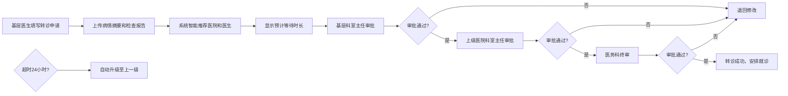
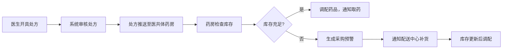

# 区域医疗联合体（医共体）综合服务与资源调度平台 - PRD

## 1. 产品概述

区域医疗联合体综合服务与资源调度平台是连接多家医院和社区卫生中心的一体化医疗服务系统，旨在优化医疗资源配置、提升诊疗效率、降低患者就医成本。平台覆盖患者智能转诊、远程会诊、检查检验互认、处方流转、费用结算等核心业务场景，通过数据驱动的智能决策支持，实现医共体内资源的高效调度与协同服务。

## 2. 核心功能

### 2.1 用户角色

| 角色 | 注册方式 | 核心权限 |
|------|----------|----------|
| 基层医生 | 系统分配 | 填写转诊申请、查看检查结果、开具处方、发起远程会诊 |
| 上级医生 | 系统分配 | 接收转诊患者、参与远程会诊、查看病历和影像 |
| 科室主任 | 系统分配 | 审批转诊申请、科室管理、查看科室统计数据 |
| 医务科 | 系统分配 | 三级审批、监督转诊流程、处理异常升级 |
| 管委会管理员 | 系统分配 | 系统管理、权限配置、查看全局数据、导出运营报告 |

### 2.2 功能模块

1. **首页大屏**：实时展示转诊量、会诊量、床位占用率、检查互认率、药品库存周转等核心指标
2. **智能转诊**：病情摘要填写、智能医院推荐、三级审批流程、超时自动升级
3. **远程会诊**：多学科专家会诊、病历影像在线查看、会诊记录自动归档
4. **检查检验互认**：结果跨院共享、重复项目自动标记、智能提醒
5. **处方流转**：处方跨院流转、缺药自动预警、配送中心通知
6. **费用结算**：医保政策适配、自动分成计算、结算对账单生成
7. **数据报表**：多维度筛选、月度运营分析报告导出

### 2.3 页面详情

| 页面名称 | 模块名称 | 功能描述 |
|----------|----------|----------|
| 登录页 | 身份认证 | 账号密码登录、角色选择、忘记密码 |
| 首页大屏 | 数据看板 | 核心指标实时展示（每5秒刷新）、趋势图表、地图分布 |
| 转诊管理 | 转诊申请 | 新建转诊、病情摘要、检查报告上传、智能推荐医院医生 |
| 转诊管理 | 转诊审批 | 待审批列表、审批操作、审批历史、超时提醒 |
| 远程会诊 | 会诊列表 | 待会诊、进行中、已完成会诊列表 |
| 远程会诊 | 会诊室 | 多方视频、病历查看、影像浏览、会诊记录编辑 |
| 检查检验 | 结果查询 | 检查报告列表、详情查看、重复项标记 |
| 处方管理 | 处方流转 | 处方列表、药房调配、缺药预警、采购通知 |
| 费用结算 | 结算管理 | 结算单列表、分成明细、对账单导出 |
| 系统管理 | 权限管理 | 用户管理、角色配置、权限分配 |
| 数据报表 | 运营分析 | 多维度筛选、图表展示、月度报告导出 |

## 3. 核心流程

### 3.1 智能转诊流程

### 3.2 远程会诊流程

### 3.3 处方流转流程

## 4. 用户界面设计

### 4.1 设计风格

- **主色调**：医疗蓝 (#0066CC) - 代表专业、信任、科技
- **辅助色**：健康绿 (#00B578) - 代表生命、希望、成功
- **警示色**：橙红 (#FF6B35) - 用于超时提醒、缺药预警
- **中性色**：深灰 (#1F2937)、中灰 (#6B7280)、浅灰 (#F3F4F6)
- **按钮风格**：圆角8px，主按钮使用医疗蓝渐变，悬停有阴影和缩放效果
- **字体**：标题使用 Noto Sans SC Bold，正文使用 Noto Sans SC Regular
- **布局风格**：卡片式布局，顶部导航+左侧菜单+内容区三栏结构
- **图标**：使用 Lucide 线性图标，保持简洁统一

### 4.2 页面设计概述

| 页面名称 | 模块名称 | UI元素 |
|----------|----------|--------|
| 首页大屏 | 数据看板 | 大尺寸数字卡片、趋势折线图、环形进度图、热力地图、数据脉冲动画 |
| 转诊管理 | 转诊申请 | 表单分步引导、智能推荐卡片、文件上传区域、时间轴审批记录 |
| 远程会诊 | 会诊室 | 视频网格布局、病历侧边栏、影像查看器、实时聊天面板 |
| 检查检验 | 结果查询 | 时间轴报告列表、重复项高亮标签、PDF预览组件 |
| 费用结算 | 结算管理 | 明细表格、分组折叠面板、财务图表、导出按钮组 |

### 4.3 响应式

- 桌面端优先设计，支持1920×1080及以上分辨率
- 侧边栏支持折叠收起，内容区自适应宽度
- 表格支持横向滚动，移动端优化为卡片式展示
- 触控目标最小尺寸44×44px

### 4.4 交互动效

- 数据大屏数字滚动动画，每秒平滑过渡
- 卡片悬停时轻微上浮（translateY(-2px)）并增加阴影
- 审批流程时间轴节点渐进式出现动画
- 预警信息脉冲闪烁效果
- 页面切换时淡入淡出过渡（300ms）
