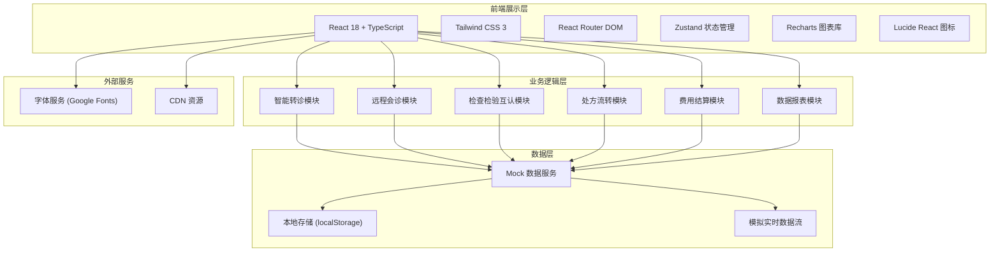

# 区域医疗联合体（医共体）综合服务与资源调度平台 - 技术架构

## 1. 架构设计



## 2. 技术描述

- **前端框架**：React 18 + TypeScript
- **构建工具**：Vite 5
- **样式方案**：Tailwind CSS 3
- **路由管理**：React Router DOM v6
- **状态管理**：Zustand
- **图表组件**：Recharts
- **图标库**：Lucide React
- **后端**：纯前端Mock数据，模拟后端API
- **数据持久化**：localStorage 存储用户信息和配置

## 3. 路由定义

| 路由 | 页面 | 权限要求 |
|------|------|----------|
| /login | 登录页 | 公开 |
| /dashboard | 首页大屏 | 所有登录用户 |
| /referral | 转诊管理 | 基层医生、科室主任、医务科 |
| /referral/apply | 新建转诊 | 基层医生 |
| /referral/approval | 转诊审批 | 科室主任、医务科 |
| /consultation | 远程会诊 | 所有医生、科室主任 |
| /consultation/room/:id | 会诊室 | 相关专家和医生 |
| /examination | 检查检验 | 所有登录用户 |
| /prescription | 处方管理 | 医生、药房人员 |
| /settlement | 费用结算 | 财务、医务科、管理员 |
| /reports | 数据报表 | 科室主任、医务科、管理员 |
| /admin | 系统管理 | 管委会管理员 |

## 4. 核心数据类型定义

```typescript
// 用户类型
interface User {
  id: string;
  name: string;
  role: 'grassroots_doctor' | 'senior_doctor' | 'department_director' | 'medical_affairs' | 'admin';
  hospital: string;
  department: string;
  avatar?: string;
}

// 医院类型
interface Hospital {
  id: string;
  name: string;
  level: 'tertiary' | 'secondary' | 'community';
  address: string;
  departments: Department[];
  bedCapacity: number;
  occupiedBeds: number;
}

// 转诊申请
interface ReferralApplication {
  id: string;
  patientName: string;
  patientId: string;
  diseaseType: string;
  summary: string;
  reports: string[];
  fromHospital: string;
  fromDepartment: string;
  fromDoctor: string;
  recommendedHospital?: string;
  recommendedDoctor?: string;
  estimatedWaitTime: number;
  status: 'draft' | 'pending_level1' | 'pending_level2' | 'pending_level3' | 'approved' | 'rejected' | 'escalated';
  currentLevel: number;
  createdAt: Date;
  lastUpdatedAt: Date;
  approvalHistory: ApprovalRecord[];
}

// 审批记录
interface ApprovalRecord {
  id: string;
  referralId: string;
  level: number;
  approver: string;
  role: string;
  action: 'approve' | 'reject' | 'escalate';
  comment?: string;
  createdAt: Date;
}

// 远程会诊
interface Consultation {
  id: string;
  title: string;
  patientName: string;
  patientId: string;
  initiator: string;
  hospital: string;
  department: string;
  experts: string[];
  scheduledTime: Date;
  status: 'scheduled' | 'in_progress' | 'completed' | 'cancelled';
  medicalRecords: string[];
  images: string[];
  conclusion?: string;
  createdAt: Date;
}

// 检查报告
interface ExaminationReport {
  id: string;
  patientId: string;
  patientName: string;
  type: string;
  itemName: string;
  hospital: string;
  department: string;
  doctor: string;
  result: string;
  reportDate: Date;
  isDuplicate: boolean;
  originalReportId?: string;
}

// 处方
interface Prescription {
  id: string;
  patientName: string;
  patientId: string;
  doctor: string;
  hospital: string;
  department: string;
  drugs: PrescriptionDrug[];
  status: 'pending' | 'dispensed' | 'shortage' | 'completed';
  createdAt: Date;
}

interface PrescriptionDrug {
  id: string;
  name: string;
  specification: string;
  dosage: string;
  quantity: number;
  price: number;
  stockStatus: 'sufficient' | 'low' | 'out_of_stock';
}

// 费用结算
interface Settlement {
  id: string;
  patientId: string;
  patientName: string;
  fromHospital: string;
  toHospital: string;
  totalAmount: number;
  insuranceCoverage: number;
  patientPayment: number;
  hospitalSplit: HospitalSplit[];
  settlementDate: Date;
  status: 'pending' | 'completed';
}

interface HospitalSplit {
  hospital: string;
  amount: number;
  percentage: number;
}

// 统计数据
interface DashboardStats {
  totalReferrals: number;
  todayReferrals: number;
  totalConsultations: number;
  todayConsultations: number;
  bedOccupancyRate: number;
  examinationMutualRecognitionRate: number;
  drugInventoryTurnover: number;
  referralsByHospital: { name: string; value: number }[];
  consultationsTrend: { date: string; count: number }[];
  bedUsageByHospital: { name: string; total: number; occupied: number }[];
}
```

## 5. 项目结构

```
src/
├── components/          # 通用组件
│   ├── layout/         # 布局组件
│   │   ├── Header.tsx
│   │   ├── Sidebar.tsx
│   │   └── MainLayout.tsx
│   ├── common/         # 基础组件
│   │   ├── Card.tsx
│   │   ├── Button.tsx
│   │   ├── Table.tsx
│   │   ├── Modal.tsx
│   │   └── StatCard.tsx
│   └── charts/         # 图表组件
│       ├── LineChart.tsx
│       ├── BarChart.tsx
│       └── PieChart.tsx
├── pages/              # 页面组件
│   ├── Login.tsx
│   ├── Dashboard.tsx
│   ├── referral/
│   │   ├── ReferralList.tsx
│   │   ├── ReferralApply.tsx
│   │   └── ReferralApproval.tsx
│   ├── consultation/
│   │   ├── ConsultationList.tsx
│   │   └── ConsultationRoom.tsx
│   ├── examination/
│   │   └── ExaminationList.tsx
│   ├── prescription/
│   │   └── PrescriptionList.tsx
│   ├── settlement/
│   │   └── SettlementList.tsx
│   ├── reports/
│   │   └── Reports.tsx
│   └── admin/
│       └── Admin.tsx
├── store/              # 状态管理
│   ├── useAuthStore.ts
│   ├── useDashboardStore.ts
│   └── useReferralStore.ts
├── utils/              # 工具函数
│   ├── mockData.ts
│   ├── format.ts
│   └── constants.ts
├── types/              # 类型定义
│   └── index.ts
├── App.tsx
├── main.tsx
└── index.css
```

## 6. 核心实现要点

### 6.1 实时数据刷新
- 使用 `setInterval` 每5秒模拟数据更新
- Zustand store 管理实时数据状态
- 数字变化时使用动画过渡效果

### 6.2 智能推荐算法
- 基于疾病类型匹配科室专长
- 结合挂号余量和床位占用率计算推荐分数
- 显示预计等待时长（基于历史数据估算）

### 6.3 审批流程引擎
- 三级审批状态机实现
- 超时检测机制（24小时自动升级）
- 审批历史时间轴展示

### 6.4 权限控制
- 路由级权限守卫
- 组件级权限渲染控制
- 基于角色的功能菜单动态生成

### 6.5 数据导出
- 模拟Excel/CSV导出功能
- 支持按医院、科室、日期筛选
- 月度报告自动生成（PDF格式模拟）
